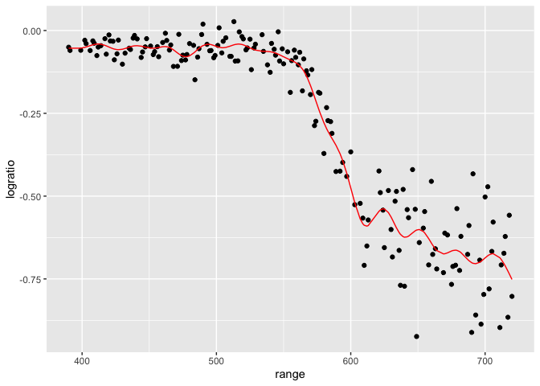

cross_validation
================
Ravi Brenner
2024-11-12

Look at LIDAR data

``` r
data("lidar")

lidar_df <- lidar |>
  as_tibble() |>
  mutate(id = row_number())
```

``` r
lidar_df |>
  ggplot(aes(x = range, y = logratio)) + 
  geom_point()
```

<!-- -->

## Try to do CV

Compare 3 models - linear, smooth, wiggly

construct training and testing df

``` r
train_df <- sample_frac(lidar_df, size = 0.8)
test_df <- anti_join(lidar_df, train_df, by = "id")
```

look at these

``` r
train_df |>
  ggplot(aes(x = range, y = logratio)) + 
  geom_point() +
  geom_point(data = test_df, color = "red")
```

<!-- -->

fit three models

``` r
linear_mod <- lm(logratio ~ range, data = train_df)
smooth_mod <- gam(logratio ~ s(range), data = train_df)
wiggly_mod <- gam(logratio ~ s(range, k = 30), sp = 10e-6, data = train_df)
```

Look at these fits

``` r
train_df |>
  add_predictions(linear_mod) |>
  ggplot(aes(x = range, y = logratio)) + 
  geom_point() + 
  geom_line(aes(y = pred), color = "red")
```

<!-- -->

``` r
train_df |>
  add_predictions(wiggly_mod) |>
  ggplot(aes(x = range, y = logratio)) + 
  geom_point() + 
  geom_line(aes(y = pred), color = "red")
```

<!-- -->

``` r
train_df |>
  add_predictions(smooth_mod) |>
  ggplot(aes(x = range, y = logratio)) + 
  geom_point() + 
  #geom_point(data = test_df, color = "red") + 
  geom_line(aes(y = pred), color = "red")
```

<!-- -->

compare numerically using RMSE (want lowest value)

``` r
rmse(linear_mod, test_df)
```

    ## [1] 0.127317

``` r
rmse(smooth_mod, test_df)
```

    ## [1] 0.08302008

``` r
rmse(wiggly_mod, test_df)
```

    ## [1] 0.08848557
